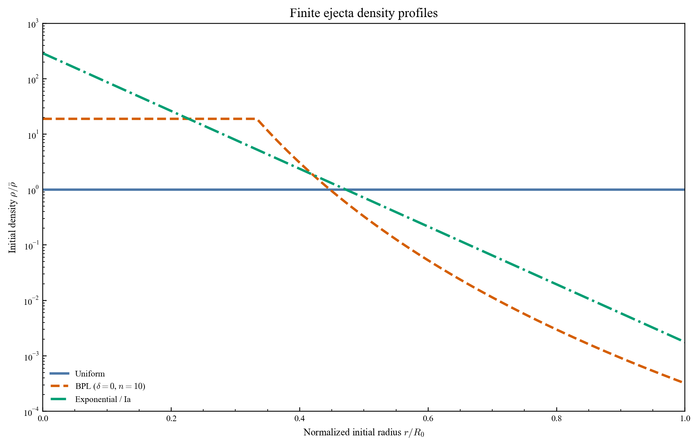
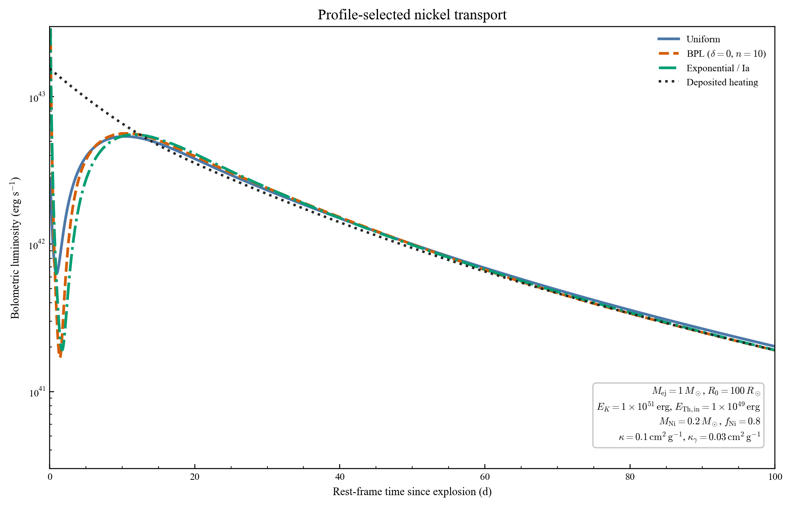

# TransFit Changelog

User-visible changes are recorded here, with the newest version first.

[中文版本](changelog_chinese.md)

## v0.2 — 2026-07-26

### What's new

- The CSM model now radiates from the photosphere, whose radius follows the
  forward-shock position:

  $$
  R_{\mathrm{ph}}(t)=
  \begin{cases}
  R_{\mathrm{CSM,ph}},
  & R_{\mathrm{FS}}<R_{\mathrm{CSM,ph}},\\
  R_{\mathrm{FS}}(t),
  & R_{\mathrm{CSM,ph}}\le R_{\mathrm{FS}}<R_{\mathrm{CSM,out}},\\
  a(t)R_{\mathrm{CSM,out}},
  & R_{\mathrm{FS}}\ge R_{\mathrm{CSM,out}}.
  \end{cases}
  $$

  Here, $a(t)$ is the homologous expansion factor after shock exit.

- The CSM ejecta-density indices default to fixed values `n=10` and `delta=0`.
  They can be sampled through `priors` or set explicitly through `fixed`.
- Optional reverse-shock heating is available for the CSM model. It is disabled
  by default and enters the same diffusion calculation when
  `reverse_shock=True`.

- Time sampling around the CSM transition has been improved so that the rapid
  early cooling evolution remains smooth and stable.
- The nickel model supports `uniform`, `bpl`/`broken_power_law`, and
  `exponential`/`ia` density profiles.
- `R_0` is the finite initial outer radius of the ejecta.
- `f_ni` is the Lagrangian mass coordinate reached by nickel mixing. The model
  rejects combinations with `M_ni > f_ni*M_ej`.
- BPL fits keep `delta=0` and `n=10` fixed by default. Add either parameter to
  `priors` only when it should be fitted.
- Exponential/Ia fits fix `R_0=0.01 R_sun` by default.

### API

Select the density profile directly for a forward calculation:

```python
lc = tf.lightcurve_bol(
    model="nickel",
    params=params,
    solver_kwargs={
        "Nx": 100,
        "Ny": 1000,
        "density_profile": "bpl",
    },
)
```

For fitting, put the same settings under `model_kwargs`:

```python
result = tf.fit_bol(
    data=data,
    model="nickel",
    model_kwargs={
        "solver_kwargs": {
            "Nx": 100,
            "Ny": 1000,
            "density_profile": "bpl",
        }
    },
)
```

To fit the BPL indices explicitly:

```python
priors = {
    "delta": (0.0, 2.0),
    "n": (6.0, 12.0),
}
```

### Density profiles



### Bolometric light curves


